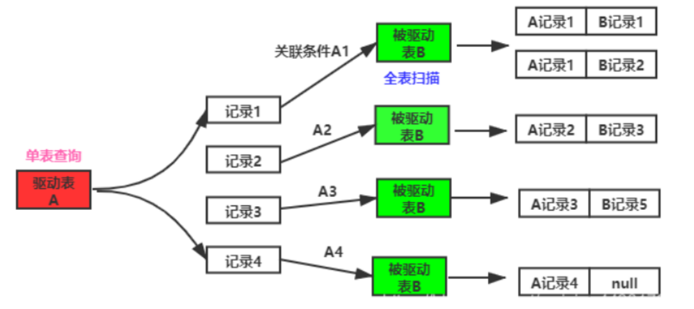
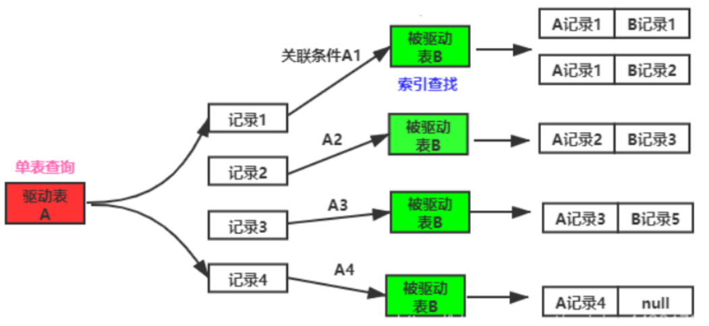
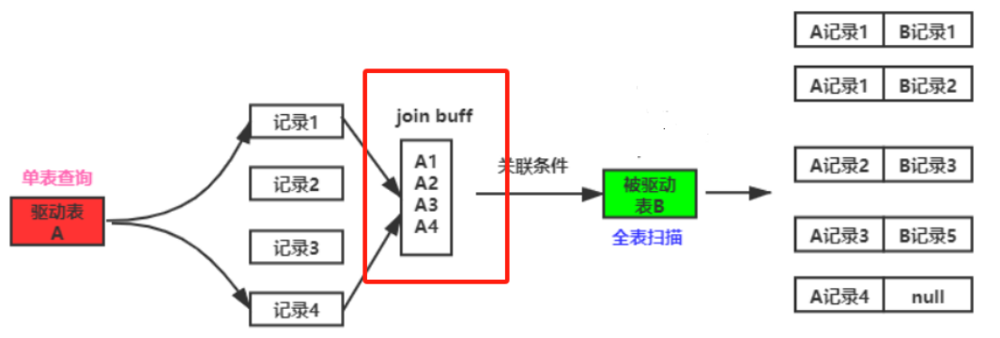

# 数据库

### 1.事务的特性(ACID):

#### 原子性(Atomicity):
```
事务中的所有操作要么全部执行，要么全都不执行。
如果事务没有原子性的保证，在发生系统故障的情况下，数据库就有可能处于不一致状态。
```
#### 一致性(Consistency):
```
如果在执行事务之前数据库是一致的，那么在执行事务之后数据库也还是一致的。
所谓一致性就是数据库中数据的完整性，包括它们的正确性。
```
#### 隔离性(Isolation):
```
即使多个事务并发（同时）执行，每个事务都感觉不到系统中有其他的事务在执行，因而也就能保证数据库的一致性。
```
#### 持久性(Durability):
```
事务成功执行后它对数据库的修改是永久的，即使系统出现故障也不受影响。
```
### 2.数据库的隔离级别有哪些？

#### 读未提交:
```
会产生：脏读、不可重复读、幻读等问题。
一个事务在执行过程中，可以看到其他事务没有提交的新增记录和更新的记录。
```
#### 读已提交:
```
会产生：不可重读、幻读等问题。
一个事务再执行过程中，可以看到其他事务已经提交的新增记录和更新的记录。
```
#### 可重复读:
```
会产生：幻读。
一个事务在执行过程中，不能看到其他事务已经提交的更新记录，但是可以看到其他事务已经提交的新增记录。
```
#### 串行化:
```
一个事务在执行过程中，完全看不到其他事务对数据库的操作。
当两个事务同时操作数据库时，如果第一个事务正在在访问该数据，第二个事务只能等到第一个事务结束之后才能访问数据。
```
注:MySQL数据库的隔离级别是可重复读. 但是MySQL的可重复读不会产生幻读。
### 3.隔离级别产生的问题
#### 脏写：
```
1.事务A修改了值，但是没有提交。
2.之后事务B修改了该值。
3.事务A回滚，导致事务B修改的值丢失
```
#### 脏读：
```
1.事务A修改了值，但是没有提交。
2.之后事务B查询了该值。
3.事务A回滚，导致事务B再次查询, 读不到之前事务A修改的数据
```
#### 不可重复读：
```
1.假设缓存页里一条数据值是A，
2.此时事务A开启之后，第一次查询这条数据，所以事务A读到的就是A值。
3.事务B将此数据修改成B，并且提交，事务A第二次查询数据，查到的值为B。
4.事务C将此数据修改成C，并且提交，事务A第三次查询数据，查到的值为C。
根据情况设定是允许重复读还是不允许重复读
```
#### 幻读：
```
幻读是指一个事务用一样的SQL语句多次查询，结果每次都包含之前没有读到的数据。
```
### 4.数据库设计的三大范式
#### 第一范式(确保每列保持原子性) :
```
保证每列保持原子性
数据库表中的所有字段值都是不可分解的原子值。
```
#### 第二范式:
```
数据库表中的每一列都和主键相关。
在一个数据库中，一个表中只能保存一种数据。
```
#### 第三范式:
```
数据库表中，每一列数据都和主键直接相关，不能间接相关。
```
### 5.MySQL存储引擎有哪些
#### MYISAM：
```
优势：较高的执行速度、占用空间相对较小。
劣势：不支持事务、不支持外键、并发性能差。
```
#### Innodb:
```
行级锁，提供了具有提交、回滚和崩溃恢复能力的事务安全，支持自动增长列，支持外键约束，并发能力强。
```
#### Memory:
```
特点：存储在内存中, 主要用于内容变化不频繁的代码表。
优势：默认使用Hash索引,检索效率非常高，速度快。
劣势：不适用于精确查找。在MySQL重启时会丢失数据。会占用和数据量成正比的内存空间。
```
### 6.什么是MVCC机制
```
1.MVCC
全称是多版本并发控制 (Multi-Version Concurrency Control)。
主要用到了Undo_Log链和ReadView数据结构。

2.undo_log
数据在修改之前会拷贝一份到undo_log链。
两个隐藏字段：
trx_id：表示最近一次更新这条数据的事务ID。
roll_pointer_id：指向更新这条数据之前生成的undo_log数据。

3.ReadView
隔离级别不同，创建次数不同：
读已提交: 每次执行查询的时候都会创建ReadView
可重复读: 仅在第一查询的时候生成ReadView, 后续复用此ReadView

四个字段：
m_ids:当前活跃的事务编号。
min_trx_id:最小活跃事务编号。
max_trx_id:预分配事务编号，当前最大事务编号+1。
creator_trx_id:创建ReadeView的事务编号。
```
### 7.SQL语句调优
#### 1.连表查询优化
```
1.使用小表驱动大表。
    inner join自动选择小表作为驱动表。
    left join 将左边的表当作驱动表,应该将小表放到左边。
    right join将右边的表当作驱动表,应该将小表放到右边。
2.给连接字段添加索引
3.驱动表与被驱动表都通过索引进行查询
```
#### 2.组合索引的使用规则
```
1.等值匹配原则: where条件里的字段的名称和顺序与组合索引一摸一样
2.最左前缀原则: 使用like语句操作, 写成like"值%"
3.最左匹配原则: 根据组合索引的最左侧的部分字段来查询
4.范围规则: 将范围查询的条件放到组合索引的最后
5.等值匹配+范围匹配: 组合索引的最左侧的多个字段进行等值匹配+范围规则
```
#### 3.MySQL深度分页问题
```
1.首先给查询条件添加索引,
2.接着使用此索引查询, 得到主键id. (此时查询直接使用的是覆盖索引, 不需要回表)
3.然后将查出来的数据作为临时表, 连接原表, 对查询出来的结果进行数据回表.
```
#### 4.索引的其他使用的规则
```
1.表中的索引不能太多. 一般情况下2~3个组合索引, 配合1~2个单字段索引进行查询
2.保证主键是有序的(否则数据库需要页分裂)
3.根据where条件,order by条件,group by条件创建组合索引. 如果创建的组合索引覆盖不了这三个条件, 尽量让where条件的字段使用索引
4.如果字段的取值比较少, 可以不用索引
5.不要在索引上进行计算, 不要在索引使用函数
6.使用覆盖索引, 需要查询的字段值直接在索引树里就能取出来, 不需要回表到聚簇索引查询
7.尽量避免select *
8.索引不要包含null值
9.sql语句不按照添加的索引执行, 可以使用force index强制执行
```
#### 5.使用Explain关键字查看SQL语句的执行计划,是否使用索引,是否全表扫描
```
需要关注的列:
id             查询编号
type           本次查询表连接的类型
possible_keys  可能使用的索引
key            实际使用的索引
extra          额外信息
```
type列的取值性能从高到低顺序(system>const>eq_ref>ref>range>index>all)
```
system: 表中只有一条记录 查询条件主键或者唯一索引
const: 查询条件主键或者唯一索引
eq_ref: 通过主键连表查询
ref: 查询条件是非聚簇索引
range: 查询条件是一个范围
index: 查询的所有字段都是非聚簇索引的字段。
all: 全表扫描
```
extra显示的内容
```
using filesort: 排序时没有使用索引
using tempoary: 分组时没有使用索引
Using join buffer(Block Nested Loop): 链表查询时没有使用索引,使用的是块嵌套查询
```
### 8.介绍下MySQL连接算法

```
Simple Nested-Loop Join（简单嵌套循环连接）(一句话: 被驱动表是全表扫描)
    1.驱动表A中拿取关联条件A1匹配被驱动表B所有列, 得到结果记录.
    2.继续A2,A3…直到驱动表A中所有关联条件匹配完.
    3.合并所有记录.
这种算法要对被驱动表B进行An次访问, 而且每次访问被驱动表B都是全表扫描. 性能非常差.
```

```
Index Nested-Loop Join (索引嵌套循环连接)(一句话: 被驱动表使用索引查询)
    1.从驱动表A中拿取关联条件A1匹配被驱动表B, 被驱动表B是基于索引查询(执行速度非常快,因为不用全表扫描),得到结果记录.
    2.继续A2,A3…直到驱动表A中所有关联条件匹配完.
    3.合并所有记录.
这种算法要对被驱动表B进行An次访问, 而被驱动表B每次基于索引查询是非常快的, 性能完全取决于驱动表A的关联条件条数。
```

```
Block Nested-Loop Join (块嵌套循环连接)
    在有索引的情况下，MySQL 会尝试去使用 Index Nested-Loop Join 算法，在有些情况下，可能
Join 的列就是没有索引，那么这时 MySQL 的选择绝对不会是最先介绍的 Simple Nested-Loop Join
算法，而是会优先使用Block Nested-Loop Join 的算法。（此句不要背诵自己看看就好）
    块嵌套循环对比简单嵌套循环多了一个中间处理的过程，也就是join buffer.
块嵌套循环将驱动表查询JOIN的相关列都给缓冲到JOIN BUFFER 当中，然后批量与被驱动表进行比较.
这样实现的话，可以将多次比较合并到一次，降低了非驱动表的访问频率。
```
### 9.索引是什么?索引分类?主键索引和唯一索引的区别?
#### 1.索引是什么
```
索引是B+树结构,可以帮助MySQL高效获取数据。
```
#### 2.索引分类
```
聚簇索引和非聚簇索引
```
#### 3.唯一索引与主键索引的区别
```
1.主键一定是唯一索引, 唯一性索引不一定是主键.
2.一个表中可以有多个唯一性索引, 但只能有一个主键.
3.主键列不允许空值, 而唯一性索引列允许空值.
```
### 10.InnoDB引擎的数据库表,如果没有在表上创建主键,这张表上是否有主键?
```
如果表中没有定义主键, 则InnoDB会选择第一个不包含有NULL值的唯一索引作为主键索引. 如果也没有这样
的唯一索引, 则InnoDB会选择内置6字节长的ROWID作为隐含的聚集索引(ROWID随着行记录的写入而主键递
增, 这个ROWID不像ORACLE的ROWID那样可引用, 是隐含的). 
```

### 11.MySQL数据库主从同步的方式有哪些?

```
1.异步复制:
MySQL默认的复制即是异步的, 主库在执行完客户端提交的事务后会立即将结果返回客户端, 并不关心从库是否已经接受并处理. 
这样就会有一个问题: 主库如果挂掉了, 此时主库上已经提交的事务可能并没有传到从库. 如果此时强行将从库提升为主库, 可能导致新主库上的数据不完整.

2.全同步复制
主库执行完一个事务, 等到所有的从库都执行了该事务, 才将结果返回给客户端. 因为需要等待所有从库执行完该事务才能返回, 所以全同步复制的性能必然会受到严重的影响

3.半同步复制
介于异步复制和全同步复制之间, 主库在执行完客户端提交的事务后不是立刻返回给客户端, 而是等待至少一个从库接收到并写到relay log中才返回给客户端. 
相对于异步复制, 半同步复制提高了数据的安全性. 为了减少半同步方式从数据库数据与主数据库数据不一致的时间, 我们可以在从数据库中配置多个线程进行同步.
```