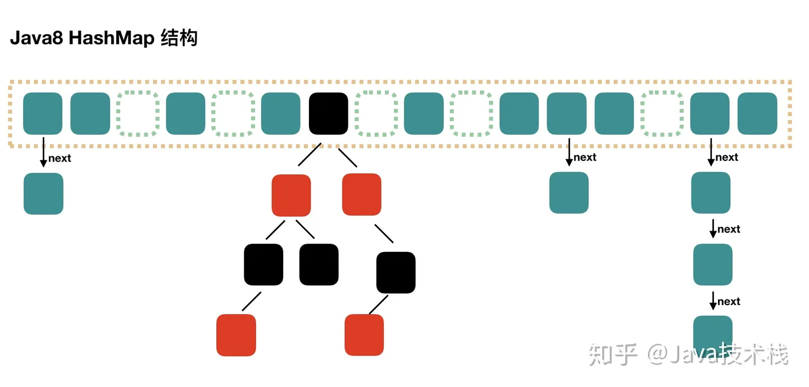
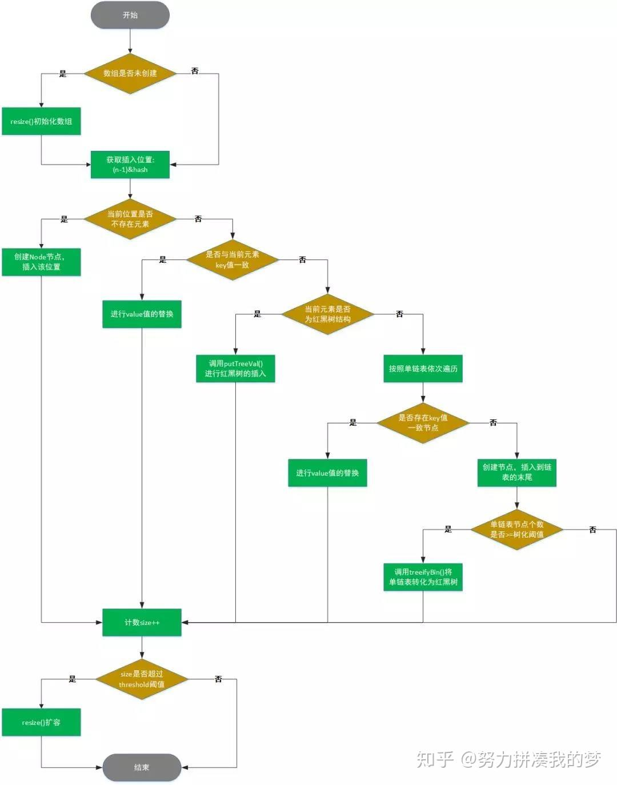
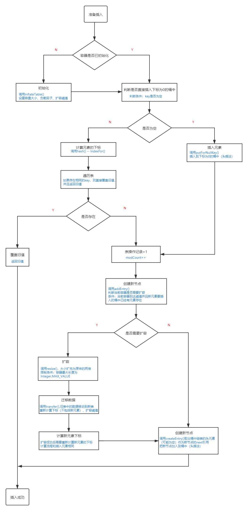

# 集合框架
### 1.ArrayList集合扩容的规则
```
1.在创建ArrayList时，可以指定初始容量。如果没有指定初始容量，则默认为10。
2.当ArrayList的当前容量不足以容纳新元素时,会触发扩容操作. 扩容时, ArrayList会创建一个容量为
原来容量1.5倍的新数组, 并将原始数组中的元素复制到新数组中。
3.扩容操作涉及创建新数组、复制元素等操作，因此会有一定的开销。建议在添加大量元素时，事先估计所
需容量，通过构造函数指定初始容量，以减少扩容次数，提高性能。
```
### 2.ArrayList LinkedList Vector的区别
```
1.ArrayList,LinkedList和Vector都继承自List接口。
2.ArrayList和Vector的底层是动态数组，LinkedList的底层是双向链表。
3.ArrayList和Vector的区别ArrayList是线程不安全的,Vector是线程安全的,Vector中的方法都是
同步方法, ArrayList的执行效率要高于Vector。
4.ArrayList和LinkedList的区别,ArrayList底层是数组,所以查找元素的速度比较快。
LinkedList底层是链表新增和删除元素的速度比较快。
```
### 3 HashMap的数据结构

```
HashMap采用数组 + 链表 + 红黑树的数据结构保存数据。HashMap在查找数据时,根据HashMap的Hash值可以快速定位到数组的具
体下标。但是在找到数组下标后需要对链表进行顺序遍历直到找到需要的数据。为了减少链表遍历的开销,Java8对HashMap进行
了优化,将数据结构优化为数组+链表+红黑树。如果链表长度大于阈值(8) 数组长度超过64,则将链表转为红黑树.
```
### 4 HashMap添加元素的过程 
```
1.首先判断数组是否为空, 如果数组为空, 则对数组进行初始化, 把容量扩充为16.
2.如果数组不为空, 则通过数组长度-1与新增元素的key的hash值进行位运算, 得到数组下标, 通过下标获得数组元素.
3.判断获得的数组元素是否为空, 如果为空,则使用新增键值创建节点, 将节点放在数组的此位置上.
4.如果数组元素不为空, 判断当前数组是否正在扩容, 如果正在扩容, 帮助其扩容. 判断当前元素的key值是否相同, 如果相同, 则进行value值的替换.
5.如果不同, 判断当前元素是否为红黑树结构. 如果是, 进行红黑树插值. 
6.如果不是, 按照链表依次遍历, 并统计链表长度. 如果存在key值一致的节点, 则进行value值的替换. 若不存在, 创建新节点插入到链表末尾.
如果链表长度大于阈值(8), 数组长度超过64, 则进行树进化(将链表转化为红黑树)
7.如果map中元素的个数大于扩容的阈值(数组长度*负载因子), 则需要对数组进行扩容.
```
(不背)

**注意**

HashMap默认采用数组+单链表方式存储元素，当元素出现哈希冲突时，会存储到该位置的单链表中。
但是单链表不会一直增加元素，当元素个数超过8个时，会尝试将单链表转化为红黑树存储。
但是在转化前，会再判断一次当前数组的长度，只有数组长度大于64才处理。否则，进行扩容操作。

```
1.判断当前容量大小是否为空，如果为空（未设置容量初始值），则把容量扩充为16。
2.获取key的hashCode，对hashCode进行扰动处理，计算出元素的下标。
3.根据下标判断有无hash碰撞，如果没有，则直接放入桶中。
4.如果发生碰撞，比较两个key是否相同，相同则覆盖，不同则则以链表的方式插入到尾部。（尾插法）。
5.如果插入后链表的长度超过了阈值（TREEIFY_THRESHOLD = 8），则把链表转为红黑树。
6.插入成功后，如果元素个数到达了阈值（size = 容量 * 阈值 ），则执行扩容操作判断（容量最大值为1<<31）
7.扩容成功后，对元素的下标进行重新计算。
                        
原文链接：https://blog.csdn.net/qicha3705/article/details/119549432
```



[详细分析HashMap源码](https://zhuanlan.zhihu.com/p/85730441)

### 5 HashMap HashTable的区别? 
```
HashMap和HashTable都实现了Map接口，HashMap几乎可以等价于HashTable
HashMap是线程不 安全的，HashTable是线程安全的。
HashMap可以接受为null的键值(key)和值(value)，而HashTable则不行
```
### 6 HashSet新增元素的过程？
```
(1)  HashSet 在新增数据的时候,先判断内部的数组是否为空,如果数组为空,则初始化数组。
(2)  如果数组不为空,获得向HashSet中添加的元素的哈希码(元素的hashcode方法获得哈希码) 在经过一
系列的算法,计算出该元素存储在HashSet数组中的位置。
(3) 在HashSet的数组中查找该位置上是否有元素,如果该位置上没有元素,则此元素就可以放到该位置上。
(4) 如果该位置有元素,则比较新增元素与该位置上的元素的哈希码,如果哈希码不同,新增的元素放在该位置
的链表的末尾。
(5) 如果元素的哈希码相同,新增的元素调用equals方法和原来的元素进行比较,如果equals方法的返回值
是false,表示两个元素不相等,新增的元素放在该位置的链表的末尾。
(6)如果equals方法的返回值相同,则新增失败。
```
### 7  CurrentHashMap添加元素的过程
```
1.判断key和value是否为null, 如果key或者value为null, 直接抛出异常
2.如果不为null, 判断数组是否为空, 如果数组为空, 则对数组进行初始化.
3.如果数组不为空, 通过数组长度-1与新增元素的key的Hash值进行位运算, 得到数组的下标, 通过下标获得对应的数组元素, 
4.判断获得的数组元素是否为空, 如果为空, 则使用新增键值创建节点,将节点放到数组的该位置上(使用CAS操作)
5.如果数组元素不为空, 判断当前数组是否正在扩容, 如果正在扩容, 帮助其扩容. 对当前节点进行加锁。判断当前元素的key值是否相同, 如果相同, 则进行value值的替换.
6.如果不同, 判断当前元素是否为红黑树结构. 如果是, 进行红黑树插值. 
7.如果不是, 按照链表依次遍历, 并统计链表长度. 如果存在key值一致的节点, 则进行value值的替换. 若不存在, 创建新节点插入到链表末尾.
8.如果链表长度大于阈值(8), 数组长度超过64, 则进行树进化(将链表转化为红黑树)
9.如果map中元素的个数大于扩容的阈值(数组长度*负载因子), 则需要对数组进行扩容.
```
[ConcurrentHashmap进行添加元素操作的源码分析以及注释。](https://blog.csdn.net/weixin_42642782/article/details/114223706)
